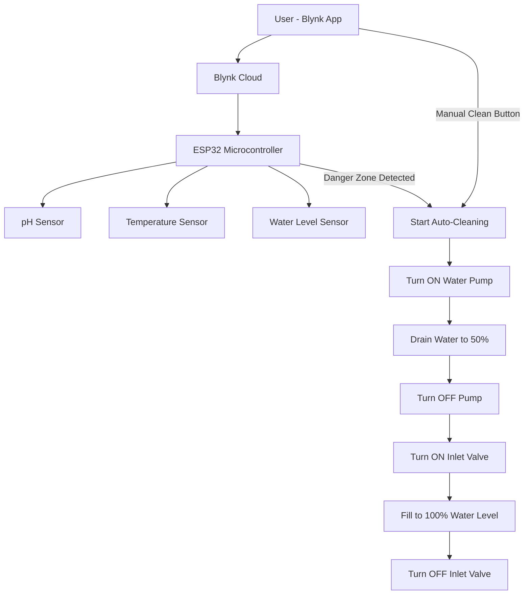

# 🐠 Smart Fish Tank Auto-Cleaning System

An **IoT-based smart aquarium system** that detects unsafe water conditions and automatically refreshes the tank water to ensure a healthy environment for fish. The system is powered by **ESP32** and utilizes multiple sensors, a relay system, a cloud dashboard, and a mobile-controlled manual cleaning option.

---

## 🚀 Features

- 🔬 Monitors **pH**, **temperature**, and **water level**
- ⚠️ Detects **dangerous zones**:
  - pH < 6 or pH > 9
  - Temperature < 25°C or > 30°C
- 🔄 Automatically cleans water if unsafe conditions are detected:
  1. Starts the **water pump** to release 50% of the tank water
  2. Stops pump and opens the **inlet valve** to refill the tank to 100%
- 📲 **Cloud-based** monitoring and control using **Blynk**
- 📉 Real-time charts for:
  - Water Temperature
  - pH Level
  - Water Level
- 🧼 **Manual clean button**: Allows users to trigger a cleaning cycle at any time via mobile app

---

## ⚙️ Components Used

| Component              | Quantity | Description                                  |
|------------------------|----------|----------------------------------------------|
| ESP32 DevKit V1        | 1        | Main microcontroller unit                    |
| pH Sensor (Analog)     | 1        | Measures acidity/alkalinity of tank water    |
| Ultrasonic Sensor (HC-SR04) | 1  | Measures water level using sound waves       |
| Waterproof Temperature Sensor (DS18B20) | 1 | Measures water temperature       |
| Water Pump             | 1        | Drains tank water                            |
| Inlet Valve (Solenoid) | 1        | Refills tank with clean water                |
| Relay Module           | 2        | Controls pump and inlet valve                |
| 5V/12V Power Supply    | 1        | Powers sensors and actuators                 |
| Limit Switch (optional)| 1        | For safe cutoff control                      |
| Blynk IoT Cloud        | -        | Real-time dashboard and mobile app control   |

---
## 📊 System Architecture

## 📱 Mobile App (Blynk)

- 📍 View temperature, pH, water level in real-time
- 📈 Charts for last 24 hours
- 🔘 Manual clean button 

---

🛠️ How to Run This Project
1.Connect hardware as per circuit design  

2.Flash the ESP32 with Arduino code  

3.Setup Blynk project and get your Auth Token

4.Add widgets:

    -Value Display for Temp, pH, Water Level

    -Super Chart for real-time monitoring

    -Button for Manual Clean

5.Power up your ESP32 and start monitoring!
